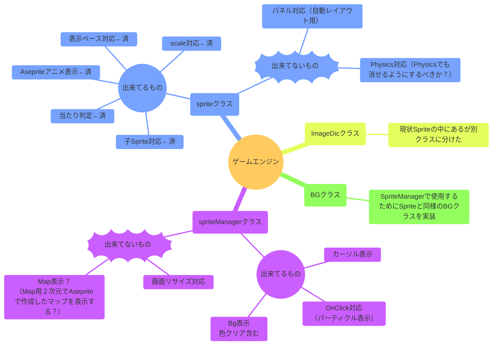
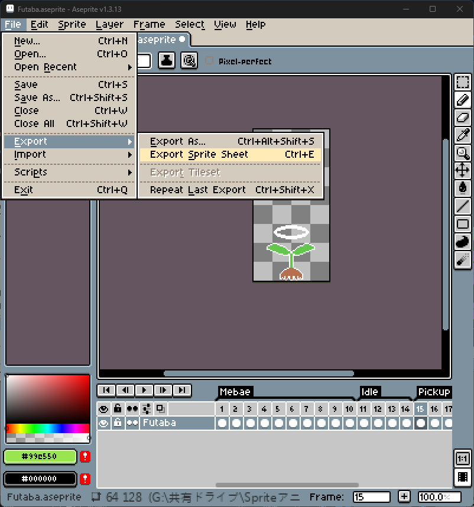
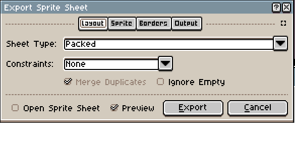
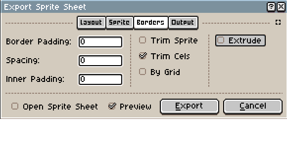
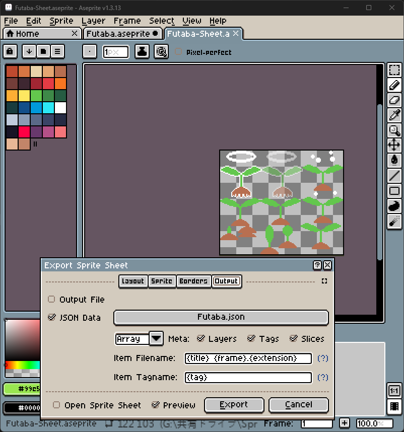
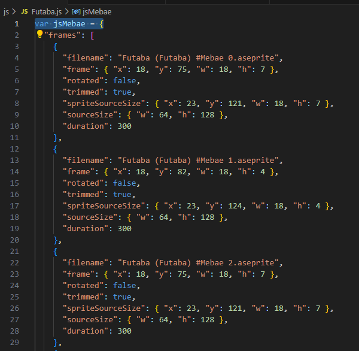
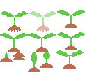

# SimpleJSGameEngine
Simple JS GameEngine

Asepriteの出力を扱えるゲームエンジン作例

- 未実装分も含めた全体構想

- ゲームエンジンとは何か
    - Godotサイトでも「ゲームエンジンとは何かを説明するのは難しい」と書かれていますが、ゲームエンジンとはあらゆるゲームを作る際のテンプレートとなるプログラムです
    - SFC、PC Engine、メガドライブなどでゲームを作っていたプログラマは各々独自のゲームエンジンを作っていました
    - シューティング、格ゲー、落ちものパズル、RPGなど様々なゲームジャンルがありますが、ゲームエンジンはすべてほぼ同じ作りです
    - 昔のブラウン管テレビでは電子ビームの走査線がブラウン管の左上から電子ビームで描画をしていました。  
      ブラウン管の左から右へ電子ビームを磁気で曲げ、カラー画像をブラウン管に投影します  
      一ライン画像を書くとすぐ下のラインをまた左から右へ描画していきます  
      そして一番下まで描画したのち、また左上へ走査線が移るのですが、このタイミングでゲーム機は次のスプライト位置を決定する必要があります
    - こうしないと描画途中のスプライトが表示されなかったり、スプライトが半欠けで表示されたりします
    - つまりゲームエンジンとは、一定周期でループ処理を行い、キー入力、物理（の疑似）計算、スプライトの表示準備などを行うものです
    - このループ処理はどのゲームでもほぼ同じです  
      なんと現在のPCなどでも同じなのです  
      HTMLでもrequestAnimationFrameにより、PCの描画リフレッシュタイミングでループ処理を行います
    - ゲームエンジンには別の側面もあります
        - データの取り込み
            - グラフィッカーの描いたスプライトやアニメデータはゲームエンジンなどとは別のプログラムで、グラフィックソフトと呼ばれるものがあり、当時は標準的なソフトも無く、ゲームメーカー各社が自前でグラフィックソフトを作っていたこともあります
            - グラフィッカーの描いた絵やアニメは更新頻度が多く、素早く取り込んで反映しなければなりません
            - グラフィックソフトからデータを取り込んで、スプライトをステート管理する部分も含みます
        - ステート管理
            - モンハンや格ゲーなどでもアニメーションの切り替えで成り立っています
                - Ａ状態（ステート）のアニメからキー入力でＢ状態になる
                - 攻撃やアイドル状態で相手の攻撃をくらったら吹っ飛びアニメになる
                - 上下左右に同じ色がいたらくっつくような形状へ変化させる
        - このようにゲームというのはすべてアニメの切り替わりで成り立っています

- これから作るゲームエンジン（作例）
    - 無限に草を抜き続けるゲーム（？）を作成します
        - すべてJavaScriptで作ります
        - パーティクルを扱います
        - マウスカーソル位置へ画像表示を行います
        - 背景画像表示します
        - マウスクリックでステートを変えます

- まずゲームの準備としてAsepriteでアニメーションスプライトを作成します

<video src="DocResources/Futaba.mp4" controls="true"></video>

- 次にこれをエクスポートします

- エクスポートダイアログのLayoutでSeetTypeをPackedにします
    - 下部のPreviewチェックがついていると、出力されるPNG画像のPackされた状況が確認できます

- エクスポートダイアログのBorderでTrim Cels をチェックします
    - ここでもスプライトがトリムされパックされた状況がPreviewで確認できます

- エクスポートダイアログのOutputで JSON Dataのチェックを入れ、「Hash」から「Array」へ変更して「Export」をクリックしてください

- JSONの確認と修正
    - 出力されたJSONはjsフォルダに保存してください
    - JSONデータの代入部分を先頭に追加してください(var jsMebae = の部分です)
    - Arrayにしているため2行目で"frames": [ のように配列となっています

- PNGの確認
    - PNGもエクスポートされますのでimagesフォルダに保存してください
    - JSONデータと比較するとPNGのどこを切り取って、どこに表示するのか、アニメーションのタイミングは何ミリSecなのかなどがわかると思います。
    - rotatedやtrimmedなど使わないデータも出力されていますので気になる方は修正されてもいいかと思います

- いよいよゲームエンジンです
    - js/gengine.jsがゲームエンジンで、全部で417行ですので読める人は読んでみてください
    - index.htmlからゲームエンジンと使っています。こちらも100行ありません
    - 合計で500行もないので、まずは自分の力で読んでみてください
    - imagesとjsにFutabaやMouseCursor、PerticleというデータがありますがこれらはすべてAsepriteで作成しエクスポートしたものです

（解説は後程追記します）